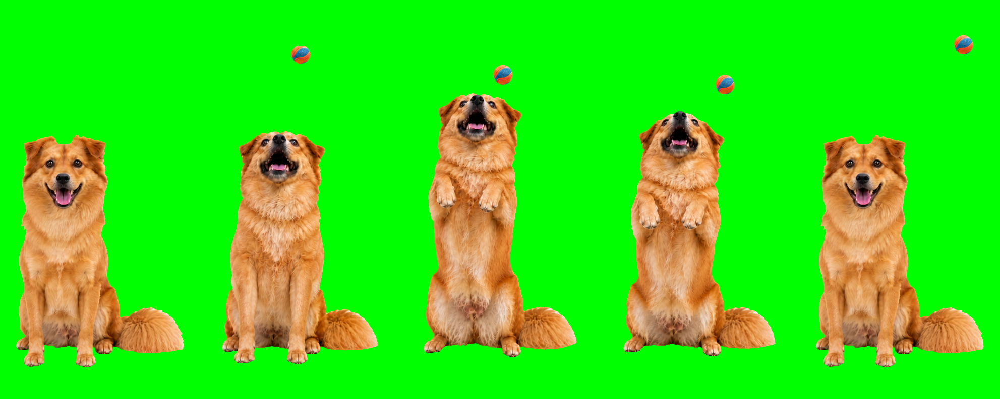

# Pickle Codex Pet

Pickle is a photorealistic animated desktop pet for the Codex desktop app, based on a real golden-russet dog. The package uses Codex pet spritesheet format v2 and includes nine standard animation states plus 16 look directions.



## Install with Codex

Copy the prompt below, paste it into Codex, and approve the installation when asked:

```text
Install the Pickle Codex desktop pet from https://github.com/Qifeng-G/pickle-codex-pet. Clone the repository, run scripts/install.sh, verify the installed files, and tell me when to restart Codex.
```

Codex will install the pet, verify the copied files, and tell you when to restart the app.

## Animation states

| State | Behavior |
| --- | --- |
| `idle` | Calm breathing and blinking |
| `running-right` | Runs toward the right |
| `running-left` | Runs toward the left |
| `waving` | Stands happily and wags the tail |
| `jumping` | Rises up and bumps a ball with the nose |
| `failed` | Disappointed reaction |
| `waiting` | Waits attentively for input |
| `running` | Focused task execution, not literal running |
| `review` | Curious close-up inspection |

MP4 previews for every state are available in [`previews/`](previews/).

## Manual installation

### 1. Download the project

```bash
git clone https://github.com/Qifeng-G/pickle-codex-pet.git
cd pickle-codex-pet
```

Alternatively, download the repository as a ZIP from GitHub and extract it.

### 2. Copy the pet package

Run the included installer on macOS or Linux:

```bash
./scripts/install.sh
```

Or copy the files manually:

```bash
mkdir -p "${CODEX_HOME:-$HOME/.codex}/pets/pickle"
cp pet/pet.json pet/spritesheet.webp "${CODEX_HOME:-$HOME/.codex}/pets/pickle/"
```

The installed directory must contain these two files together:

```text
~/.codex/pets/pickle/
├── pet.json
└── spritesheet.webp
```

If `CODEX_HOME` is configured, Codex uses `$CODEX_HOME/pets/pickle/` instead of `~/.codex/pets/pickle/`.

### 3. Restart Codex

Fully quit and reopen the Codex desktop app so it rescans custom pets. Open the Pets list and select **Pickle**.

If Pickle does not appear, verify that:

- `pet.json` and `spritesheet.webp` are directly inside the `pickle` directory.
- `pet.json` still contains `"spriteVersionNumber": 2`.
- The spritesheet has not been renamed or recompressed.
- Codex was fully restarted after installation.

## Package format

- Spritesheet: WebP with transparency
- Atlas size: `1536 × 2288`
- Cell size: `192 × 208`
- Layout: 8 columns × 11 rows
- Sprite version: 2
- Validation result: no errors, no warnings, and no hidden RGB residue under transparent pixels

The validation report is included at [`qa/validation.json`](qa/validation.json).

## Repository structure

```text
pickle-codex-pet/
├── pet/                 # Files copied into the Codex pets directory
├── previews/            # MP4 previews for the nine animation states
├── docs/                # Visual documentation
├── qa/                  # Atlas validation evidence
├── scripts/install.sh   # Repeatable local installer used by Codex
├── LICENSE
└── README.md
```

## Contributing

Bug reports and improvements are welcome through GitHub issues and pull requests. When changing the atlas, preserve the v2 dimensions and validate transparency, row semantics, animation continuity, and pet identity before submitting.

## License

This project is available under the [MIT License](LICENSE). The license covers the included pet artwork, configuration, previews, and documentation.
